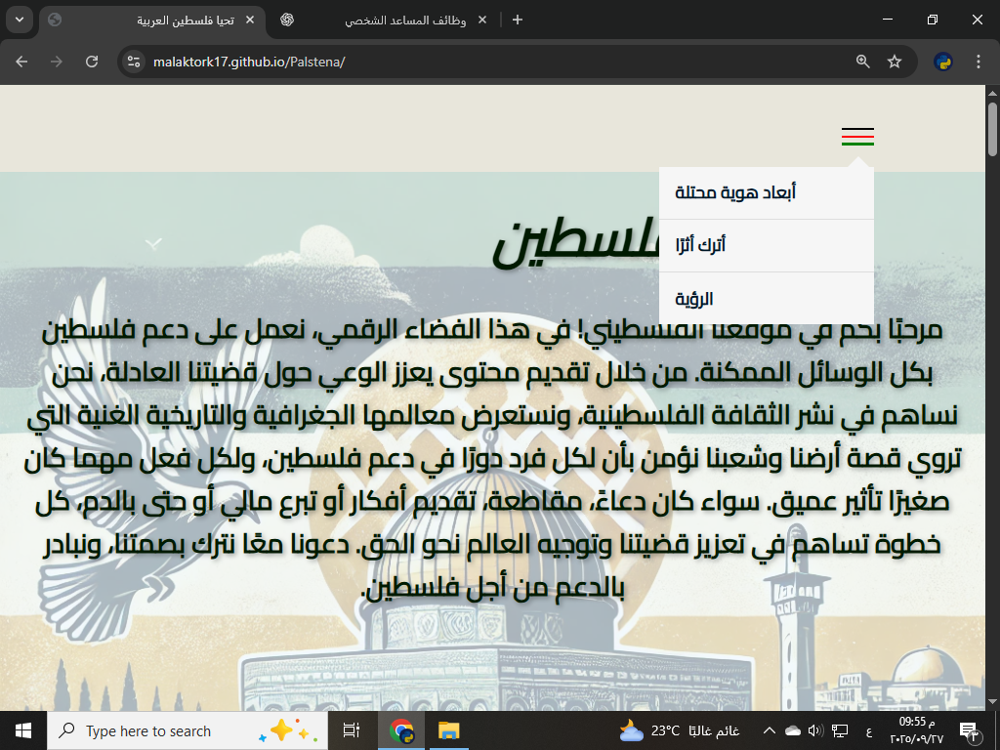

# Palestine Support Platform 🌍🇵🇸

## About the Project
This is a **prototype web project** created to raise awareness and provide practical ways to support Palestine.  
The site combines cultural and historical content with calls-to-action such as donations, boycotts, media support, and idea-sharing.

🔗 **Live Demo:** [Palestine Support Platform](https://malaktork17.github.io/Palstena/)

> ⚠️ Note: This version is an early prototype and not fully functional. It was built as part of a learning journey in web development.

---

## Vision
To create a digital hub that transforms awareness into measurable actions, supporting Palestine through education, solidarity, and grassroots initiatives.

---

## Features
- 📖 Cultural & historical pages about Palestine.  
- 💡 Awareness resources.  
- 🤝 Practical support actions (donation, boycott, blood donation, idea submission).  
- 🌐 Multilingual support (Arabic/English).  

---

## Tech Stack
- HTML, CSS.  
- Future: js / React / Node.js / MongoDB (or similar).  
- Hosting: GitHub Pages.  

---

## Roadmap
- [ ] Improve design and responsiveness.  
- [ ] Add interactive donation/idea forms.  
- [ ] Create dashboard for support actions impact.  
- [ ] Expand content with verified resources.  

---

## Screenshots
*(Add screenshots of the site here, e.g., homepage, sections, etc.)*  
Example:  

---

## عربي — نبذة عن المشروع
هذا مشروع أولي (Prototype) يهدف إلى رفع الوعي حول فلسطين وتوفير طرق عملية للدعم مثل التبرع، المقاطعة، والدعم الإعلامي.  
النسخة الحالية للتجربة والتعلم، وليست مكتملة.

---

## Contributing
This is an open project for learning purposes. Suggestions, ideas, and contributions are welcome. 🌟

---

## License
This project is open for **learning and non-commercial use**.  
